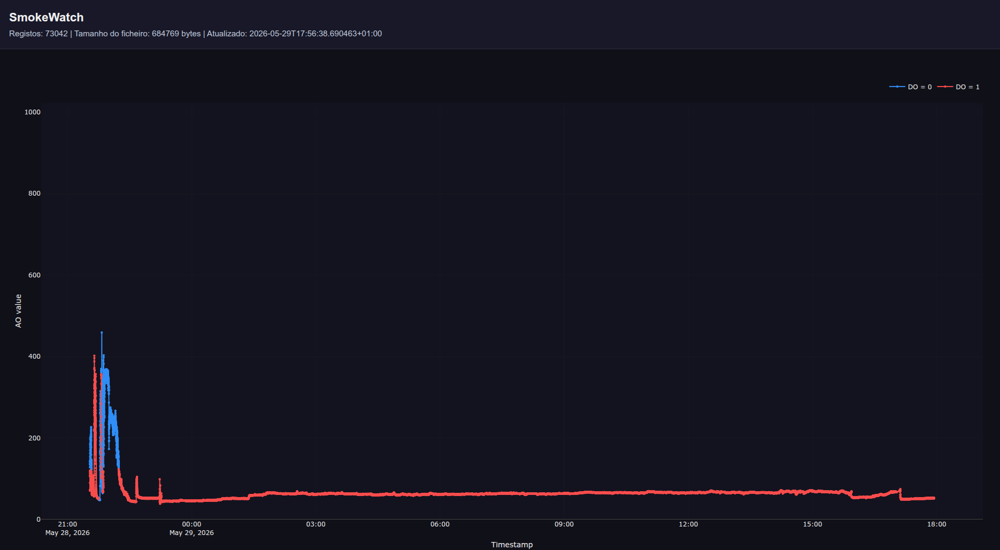
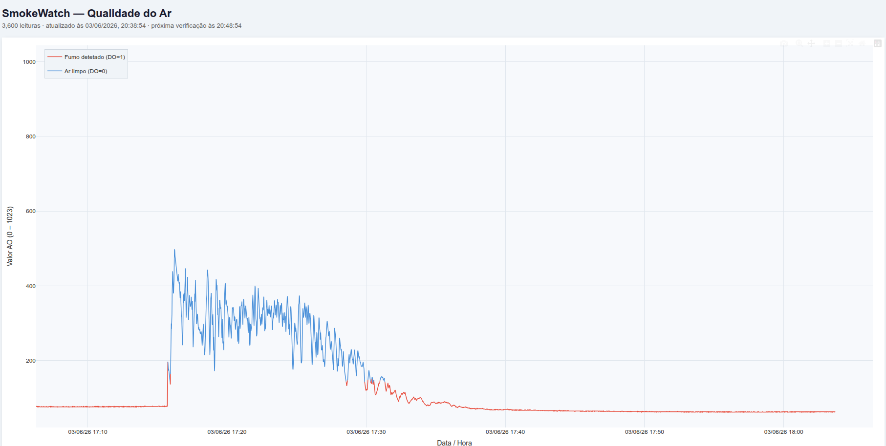

# SmokeWatch

SmokeWatch é um sistema local de monitorização da qualidade do ar com Arduino UNO, sensor MQ-135 e Raspberry Pi. O Arduino lê o sensor a cada segundo e envia leituras `AO,DO` pela porta série. O Pi adiciona um carimbo temporal, guarda as leituras em RAM, escreve-as em `data.bin` como registos compactos de 75 bits e publica um painel histórico no navegador da rede local.

## Estrutura do repositório

Este repositório contém duas implementações independentes do mesmo projeto:

- `smokewatch_vCopilot/` - versão reestruturada com subpasta `pi/` e `requirements.txt`.
  
- `smokewatch_vClaude/` - versão anterior com estrutura plana e o mesmo fluxo principal.
  
- `setup_smokewatch.py` - script na raiz que pergunta a variante, ajusta o `smokewatch.service` ao caminho real do clone e arranca o serviço.

Cada variante tem o seu próprio `README.md` com notas específicas.

## Ligações do hardware

MQ-135 para Arduino UNO:

- `VCC` -> `5V`
- `GND` -> `GND`
- `AO` -> `A0`
- `DO` -> `D2`

O sketch do Arduino também espelha `DO` no LED embutido do pino `13`.

## Fluxo de execução

1. O Arduino lê as saídas analógica e digital do sensor e envia-as a `9600` baud.
2. O Pi lê cada linha série, valida os valores e adiciona um timestamp em milissegundos.
3. A tarefa de gravação mantém as leituras em RAM e acrescenta-as a `data.bin` em lotes de 300 registos.
4. A aplicação Flask expõe um painel em `/` e dados JSON em `/data` para a interface do navegador.
5. O LED ACT do Pi fica aceso enquanto a ligação série estiver saudável.

## Formato dos dados

Cada registo em `data.bin` usa 75 bits:

- 64 bits - timestamp Unix em milissegundos
- 10 bits - valor analógico (`AO`)
- 1 bit - valor digital (`DO`)

Este formato compacto reduz o espaço ocupado sem perder o histórico completo.

## Requisitos

- Python 3.10 ou mais recente
- `Flask`
- `pyserial`
- Arduino IDE para carregar o sketch

## Instalação e arranque automatizados

A partir da raiz do clone, executa:

```bash
python3 setup_smokewatch.py
```

O script pergunta se queres usar a versão `Claude` ou `Copilot` e depois:

- reescreve o `smokewatch.service` da variante escolhida com o caminho absoluto correto do clone no Raspberry Pi;
- copia o ficheiro de serviço para `/etc/systemd/system/smokewatch.service`;
- faz `daemon-reload`, `enable` e `start` do serviço.

Com o serviço instalado, podes usar também:

```bash
make start
make stop
make restart
make logs
```

Por omissão, estes comandos usam `smokewatch.service`. Se precisares de apontar para outra unit, passa `SERVICE=smokewatch`.

Se quiseres registar as versões atuais das dependências, faz isso manualmente na shell. Exemplo:

```bash
cd smokewatch_vCopilot
python3 -m pip freeze | grep -E '^(Flask|pyserial)==' > requirements.txt
```

Na versão `Claude`, usa o mesmo comando a partir de `smokewatch_vClaude/` se quiseres criar o respetivo `requirements.txt`. Estes ficheiros ficam apenas como registo de versões e não são usados pelo bootstrapper para instalar nada.

Se precisares de mudar a porta série depois, continua a ajustar `SMOKEWATCH_SERIAL_PORT` na versão Copilot ou `config.py` na versão Claude.

## Painel web

Abre o Pi num navegador na mesma rede:

```text
http://<ip-do-pi>:5000
```

Rota útil:

- `GET /data` - devolve timestamps, valores AO, valores DO, contagem de registos, tamanho do ficheiro e a hora da última atualização.

Para descobrir o IP do Pi:

```bash
hostname -I
```

## Documentação das variantes

- [smokewatch_vCopilot/README.md](smokewatch_vCopilot/README.md)
- [smokewatch_vClaude/README.md](smokewatch_vClaude/README.md)
